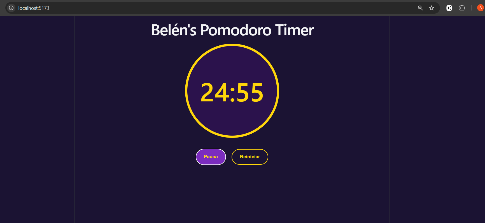
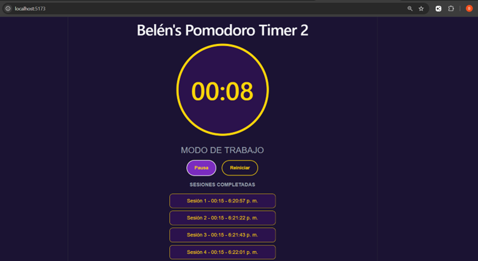
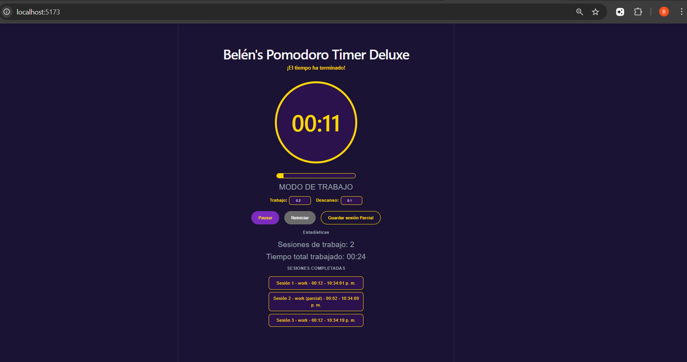

# Fase 1 

En esta primera fase realicé:



---

# Fase 2 

En esta fase se realicé:



---

# Fase 3 

En la última fase se realicé:



---

# Video Demostrativo

[Ver video demostrativo](https://canva.link/w2xq1p3skc6qj86)

---

# Cómo ejecutar el proyecto

Instalar dependencias:

```bash
npm install
```

Ejecutar proyecto:

```bash
npm run dev
```

